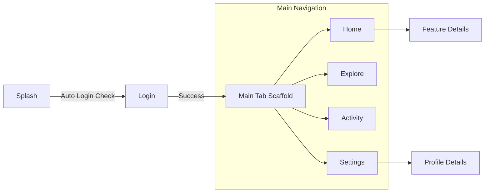
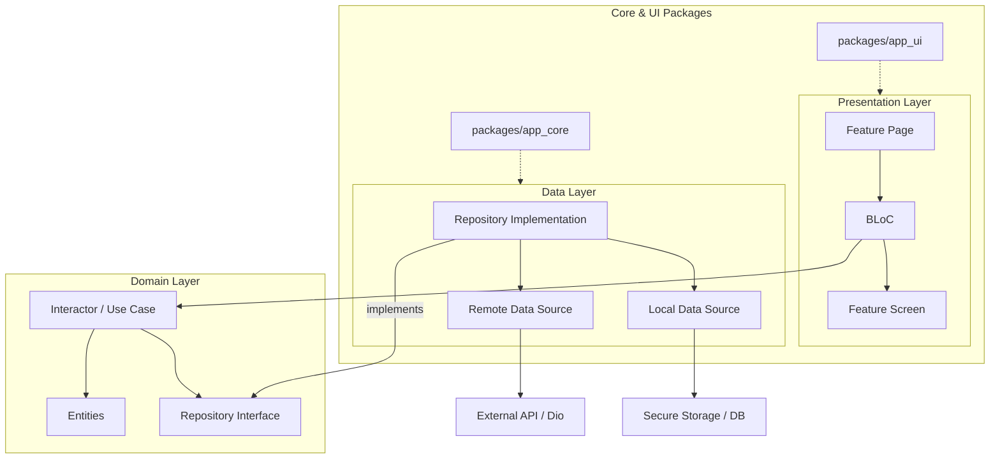

# v_clean_architecture

A Flutter project implementing Clean Architecture with a modular structure and BLoC for state management.

## Project Architecture

This project follows Clean Architecture principles, separating the application into three main layers:
1. **Data Layer**: Repositories implementations and Data Sources.
2. **Domain Layer**: Entities, Repository Interfaces, and Interactors (Use Cases).
3. **Presentation Layer**: BLoCs and UI Features.

For a detailed breakdown of the structure, see [CLEAN_ARCHITECTURE_TEMPLATE.md](./CLEAN_ARCHITECTURE_TEMPLATE.md).

## Dependency Injection
We use `get_it` for Dependency Injection. For more details on how to register and use dependencies, refer to the [DEPENDENCY_INJECTION_GUIDE.md](./DEPENDENCY_INJECTION_GUIDE.md).

## Getting Started

### Prerequisites
- Flutter SDK: v3.44.4 or above
- Dart SDK: v3.12.2 or above
- Ruby (for fastlane if applicable)
- Make (optional, but recommended for using shortcuts)

### Installation
Fetch dependencies for the main project and all local packages:
```bash
make pub-get
```

## Running the App

The project uses environment-specific configurations via `--dart-define-from-file`.

### Development (SIT)
```bash
# Using make
make dev

# Or using flutter command directly
flutter run --dart-define-from-file=env/sit.json --flavor sit
```

### UAT
```bash
make dev-uat
```

### Production
```bash
make dev-prd
```

## Development Tools

### Generating a New Feature
The project includes a script to scaffold a new feature following Clean Architecture.
```bash
make gen-feature
```

### Managing Assets
We use a custom script to manage and synchronize assets.

1. **Add assets** to `assets/` folder.
2. **Declare** them in `pubspec.yaml`.
3. **Generate constants** in `lib/constants/assets.dart`:
   ```bash
   make gen-assets
   ```
4. **Check for unused assets**:
   ```bash
   make check-assets
   ```

### Code Generation
For parts of the app using code generation (like `json_serializable` or `freezed`):
```bash
make gen
```

## App Flow & Screenshots

### Application Screenshots & Demo
To save space, you can scroll horizontally to view all screens.

| Demo & Screenshots | | | | | |
| :---: | :---: | :---: | :---: | :---: | :---: |
|  |  |  |  |  |  |
| App Demo | Splash | Home | Explore | Activity | Settings |

### Navigation Flow


## Architecture Overview



---
